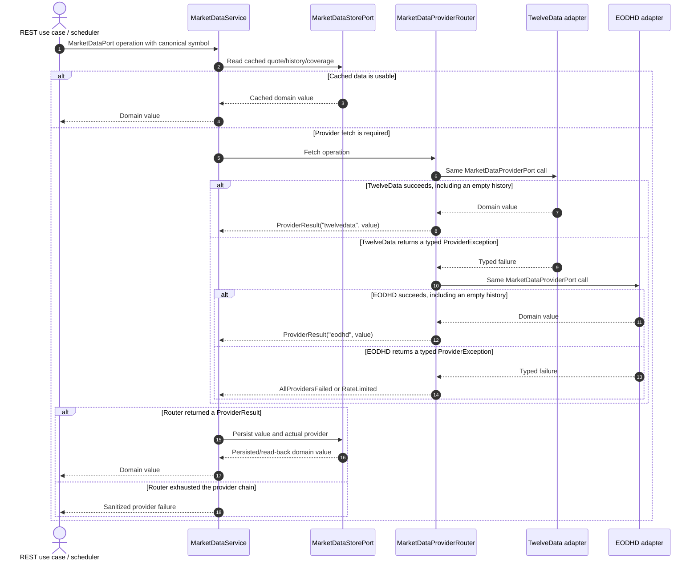
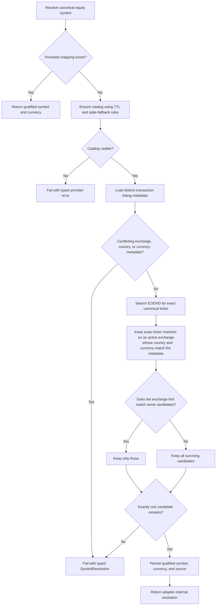

# EODHD Market-Data Provider: Design, Contracts, and Operations

> Status: implemented on `codex/eodhd-provider`; final verification recorded in the branch history<br>
> Last reviewed against the official EODHD documentation: 2026-07-26<br>
> Intended audience: implementers, reviewers, and operators of `portfolio-service`

## 1. Purpose

Add EODHD as a second implementation of `MarketDataProviderPort` while preserving the
application-facing market-data contracts. Which providers run, and in which order, is deployment
configuration; the shipped default is EODHD alone, and TwelveData remains available as a primary
or fallback entry in the chain.

The integration has four non-negotiable properties:

1. `MarketDataPort` and the four existing fetch methods on `MarketDataProviderPort` retain their
   current inputs and outputs.
2. EODHD-specific symbols, endpoint details, DTOs, currency quirks, and error translation remain
   inside the EODHD outgoing adapter.
3. Provider selection and fallback are provider-neutral application behavior.
4. The database records the provider that actually supplied each quote, history write, and
   coverage decision.

This document replaces the previous adapter-only plan. That plan deliberately left EODHD
unwired, assumed a default exchange, and treated any input containing a dot as already qualified.
Those choices do not meet the seamless-switching requirement and are unsafe for canonical
tickers such as `BRK.B`.

## 2. Sources of truth

Implementation must be checked against the current official documentation before coding and
again before merge:

- [EODHD OpenAPI 2.0 specification](https://eodhistoricaldata.github.io/EODHD-openapi/redoc.html)
- [Exchanges and exchange-symbol APIs](https://eodhd.com/financial-apis/exchanges-api-list-of-tickers-and-trading-hours)
- [Search API](https://eodhd.com/financial-apis/search-api-for-stocks-etfs-mutual-funds)
- [Live delayed quote API](https://eodhd.com/financial-apis/live-ohlcv-stocks-api)
- [End-of-day historical API](https://eodhd.com/financial-apis/api-for-historical-data-and-volumes)
- [Supported FOREX instruments](https://eodhd.com/financial-apis/list-supported-forex-currencies)
- [API limits and call accounting](https://eodhd.com/financial-apis/api-limits)

The documentation establishes these important facts:

- Equity instruments use `TICKER.EXCHANGE`, for example `AAPL.US` and `BARC.LSE`.
- General FX pairs use `BASEQUOTE.FOREX`, for example `EURUSD.FOREX`. The documented
  `EUR.FOREX` demo shorthand must not be generalized to arbitrary pairs.
- `/api/real-time/{ticker}` is a delayed quote endpoint despite its path: stocks are generally
  delayed 15-20 minutes and FX approximately one minute.
- EOD `from` and `to` are both inclusive. EODHD must not inherit TwelveData's `to.plusDays(1)`
  adjustment.
- EOD JSON contains numeric `close` and `adjusted_close` values. Literal `"NA"` is not part of
  the documented contract; accepting it is a defensive compatibility measure.
- Search returns active instruments only, supports an `exchange` filter, and returns `Code`,
  `Exchange`, `Country`, `Currency`, `ISIN`, and `isPrimary`.
- The demo key does not support search.
- The exchange catalog returns `Name`, `Code`, `OperatingMIC`, `Country`, `Currency`,
  `CountryISO2`, and `CountryISO3`.
- The service limit is 1,000 HTTP requests per minute. Daily API-call credits are a separate
  budget. Exchange, search, and EOD requests cost one API call; live quotes cost one call per
  ticker.

## 3. Public contract invariants

No REST request or response changes are required.

`MarketDataPort` remains:

```java
Uni<BigDecimal> getSpotPrice(String symbol);
Uni<BigDecimal> getFxRate(Currency base, Currency quote);
Uni<List<PriceHistoryEntry>> getPriceHistory(String symbol, LocalDate from, LocalDate to);
Uni<List<FxRateEntry>> getFxHistory(Currency base, Currency quote, LocalDate from, LocalDate to);
```

`MarketDataProviderPort` remains:

```java
Uni<BigDecimal> fetchSpotPrice(String symbol);
Uni<BigDecimal> fetchFxRate(Currency base, Currency quote);
Uni<List<PriceHistoryEntry>> fetchPriceHistory(String symbol, LocalDate from, LocalDate to);
Uni<List<FxRateEntry>> fetchFxHistory(Currency base, Currency quote, LocalDate from, LocalDate to);
```

Canonical symbols outside the adapter remain normalized, bare application symbols. The EODHD
adapter returns `AAPL`, not `AAPL.US`, in every `PriceHistoryEntry`. The shared market-data store
continues to key equity data by the canonical symbol.

## 4. Architecture

### 4.1 Components

- **`MarketDataService`** keeps its store-first behavior, freshness rules, missing-range logic,
  and in-flight request coalescing.
- **`MarketDataProviderRouter`** owns ordered provider selection, typed-failure fallback, and the
  successful provider identity.
- **`TwelveDataProviderAdapter`** remains the TwelveData implementation and gains consistent
  transport/HTTP error translation.
- **`EodhdProviderAdapter`** implements all four `MarketDataProviderPort` operations.
- **`EodhdSymbolResolver`** owns canonical-symbol to qualified-EODHD-symbol resolution.
- **`EodhdReferenceDataStore`** persists the exchange catalog and symbol mappings.
- **`InstrumentListingPort`** exposes provider-neutral transaction listing metadata to the
  resolver without exposing transaction persistence or EODHD types.
- **`ProviderSymbolMappingPort`** lets a transaction write discard a provider's cached symbol
  translation, again without naming a provider in the core.
- **`ProviderCalls`** holds the rate-limit acquisition and HTTP-failure translation both provider
  adapters need, so a raw transport exception cannot reach the router as a code defect.
- **`MarketDataStorePort`** accepts provider provenance on writes.

Portfolio valuation and performance use cases narrow their provider-neutral history calls to the
period in which data is actually required. Price history starts at the first day a ticker is held
inside the requested range (with the five-day staleness lookback); FX starts at the first exposure
or capital-flow date for each foreign currency (with the seven-day lookback). They do not pass an
unused pre-transaction chart prefix to any provider. This rule belongs to application orchestration,
not the EODHD adapter: every provider receives the same minimal `MarketDataPort` inputs, while the
EODHD adapter remains solely responsible for qualification, transport, and response semantics.

Provider implementations use a real CDI qualifier such as
`@MarketDataProviderAdapter("eodhd")`; `@Named` alone is not sufficient because it does not remove
CDI's `@Default` qualifier. Only the router is the default provider coordinator injected into the
application service.

### 4.2 Provider interaction



### 4.3 Router rules

The provider order comes from `application.market-data.providers`, defaulting to
`twelvedata,eodhd`.

The router:

1. validates that the chain is nonempty, has no duplicates, contains only registered providers,
   and has credentials for every configured provider;
2. invokes providers sequentially for one logical operation;
3. falls back only when the failure is a `MarketDataProviderError.ProviderException`;
4. treats an empty history list as a successful, authoritative response;
5. stops immediately on unexpected exceptions so code defects are not disguised as provider
   outages;
6. returns an internal `ProviderResult<T>(providerId, value)` to `MarketDataService`;
7. returns `RateLimited` with the earliest useful retry time if every provider is rate-limited;
8. otherwise returns an `AllProvidersFailed` typed exception after the chain is exhausted.

Provider identities are internal strings used for configuration, logging, and persistence. They
do not change public market-data responses.

## 5. EODHD API contract

| Adapter need | Request | Required parameters | Documented success body | Notes |
|---|---|---|---|---|
| Exchange catalog | `GET /api/exchanges-list/` | `api_token`, `fmt=json` | Array of exchange records | One API call; persisted with a TTL |
| Symbol discovery | `GET /api/search/{query}` | `api_token`, `fmt=json`; optional `exchange`, `limit`, `type` | Array of active instruments | One API call; demo key unsupported |
| Equity spot | `GET /api/real-time/{qualified}` | `api_token`, `fmt=json` | One delayed OHLCV quote | Use `close`; one call per ticker |
| Equity history | `GET /api/eod/{qualified}` | `api_token`, `fmt=json`, `period=d`, `order=a`, `from`, `to` | Array of EOD bars | Both dates inclusive; one call for any range length |
| FX spot | `GET /api/real-time/{BASEQUOTE}.FOREX` | `api_token`, `fmt=json` | One delayed quote | No equity symbol resolution |
| FX history | `GET /api/eod/{BASEQUOTE}.FOREX` | Same EOD parameters | Array of EOD bars | No equity symbol resolution |

The typed client must expose each endpoint explicitly. API tokens are query parameters because
that is EODHD's contract, but tokens must never be logged or included in application errors.

### 5.1 Typed DTOs

Use Jackson records with `@JsonIgnoreProperties(ignoreUnknown = true)` rather than `JsonNode`.

- Exchange DTO: all documented catalog fields.
- Search DTO: `Code`, `Exchange`, `Name`, `Type`, `Country`, `Currency`, `ISIN`,
  `previousClose`, `previousCloseDate`, and `isPrimary`.
- Live quote DTO: `code`, `timestamp`, `close`, and `previousClose`; unrelated OHLCV fields may be
  ignored.
- EOD bar DTO: `date`, `close`, and `adjusted_close`; unrelated OHLCV fields may be ignored.

Documented numeric fields should use `BigDecimal` with a narrow deserializer that accepts JSON
numbers and numeric strings. As defensive behavior, null, blank, and case-insensitive `NA` map to
missing data. Invalid nonnumeric text must not silently become zero.

## 6. EODHD equity symbol resolution

The port supplies only a canonical ticker, while EODHD requires an exchange-qualified symbol.
The adapter therefore owns both resolution and its provider-specific persistence.

Country hints are normalized inside this adapter before comparison. ISO alpha-2, ISO alpha-3, and
English display names share one internal identifier, so values such as `US`, `USA`, and
`United States` are equivalent. Equivalent representations across multiple transactions are not a
metadata conflict. No normalized EODHD or country identifier is returned through a domain port.

### 6.1 Interaction and decision flow



### 6.2 Resolution rules

Resolution is deterministic:

1. A persisted mapping is authoritative and is returned immediately. Nothing else runs: no catalog
   load, no listing query, no search. A catalog outage therefore cannot block pricing for an
   already-mapped symbol.
2. A mapping is discarded when a transaction write for that ticker changes the listing metadata
   behind it — see §6.4. The read path performs no staleness check of its own.
3. On a miss, load distinct provider-neutral listing metadata for the ticker from transactions.
4. More than one distinct nonblank exchange, country, or currency identity is a conflict. Do not
   select the first, most frequent, or newest value.
5. Search only exact, case-insensitive ticker-code matches; a company-name match is insufficient.
6. Country and currency hints are strict: a candidate that contradicts either is discarded.
7. The exchange hint only narrows. Broker labels such as `NASDAQ` or `BOLSA DE MADRID` match
   neither EODHD's aggregate code (`US`, `MC`) nor its MICs, so an unmatched exchange hint must
   never discard the last candidate country and currency already accepted. Where the hint does map
   to exactly one catalog exchange, it is also passed as EODHD's `exchange` search filter.
8. `isPrimary=true` may be logged as diagnostic context but must not resolve an otherwise
   ambiguous result.
9. Persist the successful `Code.Exchange`, raw price currency, and resolution source.

Search covers active instruments only. A persisted mapping continues to work for a later-delisted
instrument. A new delisted instrument that cannot be found needs an operator-inserted `MANUAL`
mapping row; the adapter will not download an entire exchange's delisted-symbol list during a
normal price request.

### 6.4 Mapping lifecycle

`ProviderSymbolMappingPort.invalidate(canonicalSymbol)` deletes the mapping. Create, update, and
delete of a transaction call it for the affected ticker (both tickers on a rename), because the
transaction's exchange/country/currency is exactly what discovery consumed. Rows with
`resolution_source = MANUAL` are operator-managed and are never deleted by invalidation.

This replaces the earlier fingerprint scheme, in which every read recomputed a hash of the
transaction metadata to detect its own staleness, and replaces configured symbol overrides, whose
persisted mappings silently outlived the removed configuration that created them.

Input dots have no provider meaning. `BRK.B` is a canonical ticker to resolve, not an instruction
to send exchange `B` to EODHD.

### 6.3 Provider-neutral listing metadata

Add an outgoing `InstrumentListingPort` with a method equivalent to:

```java
Uni<List<InstrumentListing>> findBySymbol(String canonicalSymbol);
```

`InstrumentListing` contains canonical symbol, exchange, country, and domain currency. Its
persistence adapter queries distinct transaction metadata across users. It contains no EODHD
names, exchange codes, DTOs, or resolution rules.

## 7. Exchange catalog lifecycle

The catalog is a persistent, lazy TTL cache:

1. Equity resolution checks the most recent catalog `fetched_at`.
2. A nonempty catalog younger than the configured TTL is used immediately.
3. A missing or stale catalog starts one memoized refresh `Uni`; concurrent callers join it.
4. A successful nonempty response is applied in one transaction: mark the old snapshot inactive,
   then upsert returned exchanges as active with one refresh timestamp.
5. An empty 200 response is a failure and must not erase the last good snapshot.
6. On refresh failure, stale rows are used with a warning.
7. If no stale rows exist, resolution fails with a typed provider error and the router may use the
   next provider.

FX calls do not require the exchange catalog and must not be blocked by an equity-reference-data
outage. Neither does an equity whose mapping is already persisted: only discovery consults the
catalog, so a refresh outage affects first-time resolution only.

## 8. Persistence model

The database is created from scratch, so these tables live in the base `schema.sql` rather
than in incremental change sets.

### 8.1 `eodhd_exchanges`

| Column | Purpose |
|---|---|
| `code VARCHAR(20) PRIMARY KEY` | EODHD API suffix |
| `name VARCHAR(255) NOT NULL` | Provider exchange name |
| `operating_mic VARCHAR(255)` | Raw comma-separated MIC list |
| `country VARCHAR(100)` | Provider country name |
| `currency VARCHAR(10)` | Provider default currency |
| `country_iso2 VARCHAR(2)` | ISO-2 country code |
| `country_iso3 VARCHAR(3)` | ISO-3 country code |
| `active BOOLEAN NOT NULL` | Present in latest successful snapshot |
| `fetched_at TIMESTAMPTZ NOT NULL` | Snapshot time |
| `updated_at TIMESTAMPTZ NOT NULL` | Last row update |

### 8.2 `eodhd_symbol_mappings`

| Column | Purpose |
|---|---|
| `canonical_symbol VARCHAR(32) PRIMARY KEY` | Symbol understood outside EODHD |
| `provider_symbol VARCHAR(64) NOT NULL` | Full EODHD `Code.Exchange` value |
| `exchange_code VARCHAR(20) NOT NULL` | Catalog code used by the mapping |
| `raw_currency VARCHAR(10)` | EODHD price currency before normalization |
| `resolution_source VARCHAR(32) NOT NULL` | `MANUAL`, `TRANSACTION_METADATA`, or `UNIQUE_SEARCH` |
| `resolved_at TIMESTAMPTZ NOT NULL` | Successful resolution time |
| `updated_at TIMESTAMPTZ NOT NULL` | Last row update |

`exchange_code` references `eodhd_exchanges(code)`. Inactive exchange rows remain present so an
existing mapping does not lose referential integrity.

### 8.3 Provider provenance

- Add nullable `provider VARCHAR(64)` to `spot_quotes`.
- Pass the selected provider into price-history, FX-history, spot-quote, and coverage writes.
- Remove hardcoded `"twelvedata"` values from `MarketDataService` and
  `MarketDataStoreAdapter`.
- Existing rows remain valid: current history rows already identify TwelveData; old spot rows have
  null provider until refreshed.
- Coverage conflicts update `provider` and `fetched_at` to the most recent authoritative fetch.

## 9. Currency and price normalization

EODHD live and EOD responses do not carry currency. The resolver supplies it with this priority:

1. `application.market-data.eodhd.exchange-price-currency-overrides.<EXCHANGE>`;
2. currency on the unique search result;
3. default currency from the persisted exchange catalog.

The transaction currency is a major-currency matching hint, not the raw EODHD quote unit.

Pass the selected raw currency through the existing `CurrencyResolver`. This preserves current
minor-unit behavior, for example `GBX -> GBP` with multiplier `0.01`. Apply the multiplier to:

- equity spot `close`;
- equity history `close`;
- equity history `adjusted_close`.

Do not scale FX rates. An unresolved currency produces `UnsupportedCurrency`; never assume USD or
persist a mislabeled price.

## 10. Port-operation behavior

### 10.1 `fetchSpotPrice(symbol)`

1. Resolve the canonical equity symbol.
2. Acquire an EODHD request slot.
3. Call `/api/real-time/{qualified}?fmt=json`.
4. Require a valid `close`; do not substitute `previousClose`.
5. Normalize to major currency units.
6. Return only `BigDecimal` as required by the port.

### 10.2 `fetchPriceHistory(symbol, from, to)`

1. Resolve the canonical equity symbol and currency once.
2. Call EOD with `period=d`, `order=a`, and the caller's inclusive dates unchanged.
3. Parse every bar. Required invalid date or close fails the entire fetch.
4. Use `adjusted_close` when present; otherwise use normalized close.
5. Return entries ordered by date with the canonical input symbol.
6. Return an empty list for a legitimate empty array; the router does not fall back.

### 10.3 `fetchFxRate(base, quote)`

1. Build `BASEQUOTE.FOREX` only inside the adapter.
2. Call the delayed quote endpoint and require `close`.
3. Return the unscaled rate.

### 10.4 `fetchFxHistory(base, quote, from, to)`

1. Build `BASEQUOTE.FOREX` only inside the adapter.
2. Call EOD with inclusive dates, daily period, and ascending order.
3. Map close into `FxRateEntry(base, quote, date, rate, fetchedAt)`.
4. Return an empty list for a legitimate empty array.

## 11. Failure and fallback semantics

| Condition | Adapter result | Router behavior |
|---|---|---|
| HTTP 429 | `RateLimited` using `Retry-After`, else 60 seconds | Try next provider |
| HTTP 400/401/403/404 | `ErrorResponse` with canonical symbol and sanitized status | Try next provider |
| HTTP 5xx, timeout, connection failure | `ProviderUnavailable` | Try next provider |
| Missing/null/blank/`NA` required field | `MissingData` | Try next provider |
| Invalid required numeric/date field | `MissingData` | Try next provider |
| Unsupported currency | `UnsupportedCurrency` | Try next provider |
| Missing or ambiguous symbol mapping | `SymbolResolution` | Try next provider |
| Empty history array | Successful empty list | Stop; do not fall back |
| Unexpected application exception | Original failure | Stop immediately |

After mixed typed failures from every provider, throw `AllProvidersFailed`, retain individual
failures as suppressed/internal diagnostic context, and return a sanitized 503 through a specific
exception mapper. If every failure is `RateLimited`, preserve the existing 503 plus
`Retry-After` behavior.

Never persist data or coverage for a failed fetch. A successful empty history may record coverage
because it is an authoritative response under the selected fallback policy.

## 12. Rate limiting

Add a dedicated EODHD `ReactiveRateLimiter`; never share TwelveData's budget.

```properties
application.market-data.eodhd.rate-limit.requests-per-minute=1000
application.market-data.eodhd.rate-limit.max-wait=PT2M
```

All EODHD HTTP calls, including exchange refresh and search, acquire from this limiter. Defaults
protect the documented minute request ceiling, not the account's daily call budget. Operators may
configure a lower rate for their plan. Provider HTTP 429 responses remain authoritative.

No client-side daily-credit counter is introduced in this change because daily limits depend on
the subscription and additional-call balance.

## 13. Configuration

Production defaults and environment bindings:

```properties
# Ordered provider chain. Every listed provider is validated at startup.
application.market-data.providers=${MARKET_DATA_PROVIDERS:eodhd}

application.market-data.twelve-data.api-key=${TWELVE_DATA_API_KEY}
application.market-data.eodhd.api-key=${EODHD_API_KEY}
quarkus.rest-client.eodhd-api.url=https://eodhd.com

application.market-data.eodhd.exchange-catalog-ttl=PT24H
application.market-data.eodhd.rate-limit.requests-per-minute=1000
application.market-data.eodhd.rate-limit.max-wait=PT2M

# Provider-specific quote-unit correction before CurrencyResolver.
application.market-data.eodhd.exchange-price-currency-overrides.LSE=GBX
```

Configuration holds service settings only. Per-symbol resolution is data, not configuration: the
operator escape hatch is a `MANUAL` row in `eodhd_symbol_mappings` (§6.4), which needs no restart
and cannot drift from the mapping actually in use.

Missing an API key for any listed provider fails startup. Unit and integration tests declare the
chain they exercise rather than inheriting the deployed one, so the deployed chain can change
freely. Update `.env.example`, Docker configuration, README, test profiles, and WireMock resource
configuration alongside it.

## 14. Observability and security

Log at appropriate levels:

- canonical symbol, operation, and provider attempt;
- successful provider;
- fallback transition and typed failure category;
- catalog refresh outcome and stale-catalog use;
- mapping source (`MANUAL`, `TRANSACTION_METADATA`, or `UNIQUE_SEARCH`);
- ambiguity/conflict using canonical transaction metadata.

Never log:

- API keys or full request URLs containing `api_token`;
- raw upstream bodies, which may contain account or diagnostic details;
- provider-qualified symbols outside EODHD adapter/resolver logs.

Existing correlation IDs remain the request-level diagnostic key. Provider-specific failures
returned to REST clients are sanitized.

## 15. Implementation sequence (completed)

1. Add provider-neutral listing metadata model/port and its distinct-query persistence adapter.
2. Add schema, entities, and repository operations for the exchange catalog, symbol mappings,
   and spot provenance.
3. Add EODHD DTOs and the typed REST client.
4. Implement catalog refresh and symbol resolution with unit tests.
5. Implement `EodhdProviderAdapter` and its dedicated rate limiter with unit tests.
6. Add CDI provider qualifiers and the ordered provider router.
7. Refactor `MarketDataService` and store writes to preserve actual provider provenance.
8. Normalize TwelveData transport/HTTP failures into typed provider failures.
9. Extend WireMock and integration profiles for EODHD reference and data endpoints.
10. Update operator documentation and run the complete verification pipeline.
11. Simplify: trust persisted mappings, invalidate them on transaction writes, share the
    rate-limit/failure plumbing across providers, and let tests pin their own provider chain.

## 16. Test and acceptance matrix

### 16.1 Router unit tests

- primary success does not call fallback;
- a typed primary failure calls EODHD once;
- unexpected failure does not fall back;
- empty history is a success and does not fall back;
- the successful provider ID reaches persistence;
- all-rate-limited returns the earliest retry time;
- mixed exhaustion returns `AllProvidersFailed`;
- invalid, duplicate, empty, or credential-less provider configuration fails startup.

### 16.2 Resolver and catalog unit tests

- exchange catalog refresh, TTL reuse, atomic replacement, empty-response protection, and stale
  fallback;
- concurrent refreshes share one request;
- exact exchange code, operating MIC, country, and currency matching;
- `NASDAQ` transaction metadata resolves through EODHD search to `AAPL.US`;
- `LSE` metadata resolves `BARC` to `BARC.LSE`;
- a broker label unknown to EODHD (`BOLSA DE MADRID`) still resolves `EBRO.MC` on matching
  country and currency, but a contradicting country still fails;
- a unique exact search works without transaction metadata;
- ambiguous search does not use the first or `isPrimary` result;
- conflicting transaction metadata fails;
- a persisted mapping short-circuits catalog, listing, and search entirely;
- invalidation deletes resolved mappings and preserves `MANUAL` rows;
- `BRK.B` is resolved as a canonical ticker, never parsed as an exchange suffix;
- inactive/delisted search limitations lead to the documented `MANUAL` mapping path.

### 16.3 Adapter unit tests

- all four port methods construct exact documented paths and parameters;
- EOD dates remain inclusive and `order=a` is sent;
- FX uses `BASEQUOTE.FOREX`;
- live quote close is returned and previous close is not substituted;
- close and adjusted close remain distinct;
- missing adjusted close falls back to close;
- major/minor currency scaling applies to spot and both historical prices;
- documented numeric JSON and defensive numeric-string/`NA` cases behave correctly;
- HTTP 400/401/403/404/429/5xx and transport failures map correctly;
- no EODHD-qualified symbol appears in returned domain objects.

### 16.4 Persistence and integration tests

- catalog and mapping tables round-trip through Postgres;
- actual provider is stored on spot, price history, FX history, and coverage;
- TwelveData success leaves EODHD untouched;
- a TwelveData typed error falls back through catalog/search to EODHD end to end;
- transaction `NASDAQ`/`US` metadata drives an EODHD `AAPL.US` request;
- LSE prices are normalized to GBP;
- stale catalog supports requests during a refresh outage;
- both providers failing produces a sanitized 503;
- existing TwelveData REST and ingestion behavior remains unchanged.

Verification commands:

```bash
./gradlew test
./gradlew integrationTest
./gradlew clean build
```

The final build must satisfy the existing 90% line and branch coverage thresholds.

## 17. Rollout and rollback

1. Apply the forward migration; new EODHD tables start empty and are populated lazily.
2. Deploy with both API keys and `MARKET_DATA_PROVIDERS=twelvedata,eodhd`.
3. Verify startup configuration validation and provider registration.
4. Smoke-test an equity with `NASDAQ`/`US` transaction metadata and an FX pair.
5. Confirm provider/fallback logs and database provenance.
6. Temporarily use `eodhd,twelvedata` in a controlled environment to verify EODHD as primary.

Rollback does not require dropping data: set `MARKET_DATA_PROVIDERS=twelvedata` and redeploy. The
EODHD reference tables and nullable spot-provider column can remain safely unused.

## 18. Operator runbook

- **Ambiguous or missing symbol:** correct conflicting transaction metadata, or insert a
  verified `MANUAL` row in `eodhd_symbol_mappings`. Never add a global default exchange.
- **Delisted ticker not found:** insert a verified `MANUAL` row; search covers active instruments
  only.
- **Wrong listing resolved:** fix the transaction's exchange/country and save it; that write
  deletes the mapping and the next fetch re-resolves. Delete the row by hand only for a `MANUAL`
  mapping, which invalidation deliberately leaves alone.
- **Unsupported currency:** confirm search/catalog data and add legitimate domain currency support
  or a quote-unit override. Never map an unknown currency to USD.
- **Catalog refresh failure:** stale data is used automatically when present. If no snapshot
  exists, restore EODHD access or temporarily remove EODHD from the provider chain.
- **Rate limiting:** honor `Retry-After`, lower the configured local request rate if necessary, and
  inspect the EODHD account's daily call usage separately.
- **Unexpected provider choice:** inspect ordered provider configuration and correlated fallback
  logs, then verify the `provider` column on the persisted market-data row.

## 19. Explicitly outside this change

- Changing canonical market-data identity from bare ticker to ticker plus listing.
- Supporting two simultaneous listings with the same bare ticker in the shared store.
- A REST administration API for EODHD mappings or catalog refresh.
- Automatic bulk download of active or delisted symbols for every exchange.
- New domain currency enum values unrelated to instruments currently supported by the service.
- Daily EODHD credit accounting, circuit breaking, bulk data endpoints, intraday data, or
  WebSockets.

## 20. Definition of done

The change is complete only when:

- all four EODHD port operations are implemented and provider-specific details remain internal;
- the configured provider chain, including TwelveData-to-EODHD fallback, works end to end;
- symbol/catalog data and actual provider provenance are persisted;
- canonical inputs and domain outputs contain no EODHD-qualified symbols;
- documented and defensive error cases are covered;
- diagrams and operator guidance still match the implemented flow;
- all unit, coverage, integration, and build checks pass.
