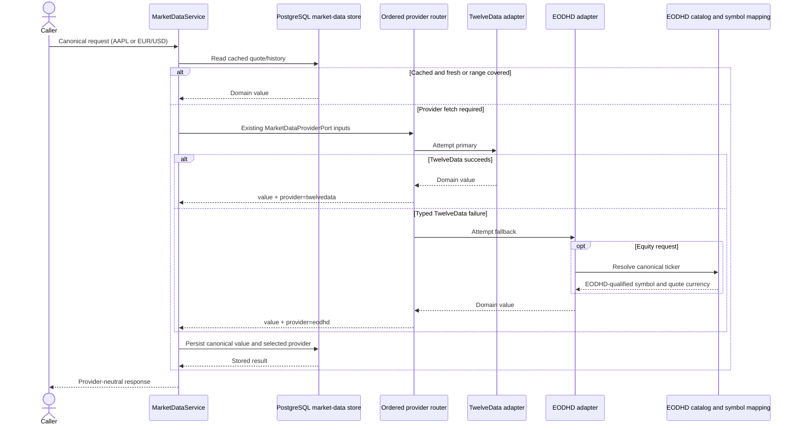
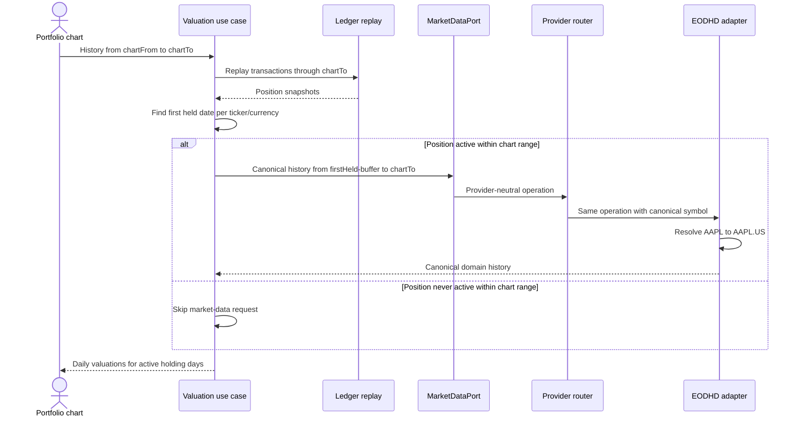

# Portfolio Service

Combined transactions + portfolio Quarkus service. The per-user transaction ledger is the single source of truth; positions and quant history are derived on read. Market data is store-first (Postgres) to avoid repeat provider costs.

## Stack

- Quarkus **3.33.2.1** LTS, Java 21
- Hibernate Reactive + Panache, PostgreSQL, Liquibase
- Ordered TwelveData + EODHD market-data adapters (store-first read-through with fallback)
- Native + JVM Docker images

## Multi-user

Every API request (except `/q/*`) requires header:

```
X-User-Id: <trusted-user-id>
```

Identity is assumed already authenticated by the VPC edge. Ledger rows are scoped by `user_id`. Market data is global/shared.

## Key endpoints

| Area | Paths |
|------|--------|
| Transactions | `/api/transactions` CRUD + search + count |
| Positions | `/api/positions`, `/active`, `/ticker/{ticker}`, `/ticker/{ticker}/price` |
| Portfolio | `/api/portfolio/summary`, `/summary/active` |
| Daily history | `/api/daily-history/positions`, `/prices`, `/portfolio/valuation`, `/capital-flows`, `/performance-inputs` |
| Ingestion | `/api/price-ingestion/runs`, `/runs/latest` |

## Full stack (Docker Compose)

From this directory, native build is the default:

```bash
cd portfolio-service
cp .env.example .env
# Set the API key for every provider named in MARKET_DATA_PROVIDERS.
docker compose up --build
```

| Service | URL |
|---------|-----|
| API | http://localhost:8087 |
| Swagger | http://localhost:8087/q/swagger-ui |
| Health | http://localhost:8087/q/health |
| Adminer | http://localhost:8094 (server: `postgresql`) |
| Postgres | `localhost:5436` / `portfolio_service_db` |

Faster JVM image (skips GraalVM native compile):

```bash
DOCKERFILE=Dockerfile.jvm docker compose up --build
```

All API calls need `X-User-Id`:

```bash
curl -H "X-User-Id: demo" http://localhost:8087/api/transactions
```

## Local run (dev mode)

```bash
docker compose up -d postgresql adminer
./gradlew quarkusDev
```

Default HTTP port: **8087**. DB: `localhost:5436/portfolio_service_db`.

## Tests

Test and JaCoCo configuration lives in `gradle/testing.gradle`.

Unit tests (JaCoCo gate: **≥90% line and branch** coverage):

```bash
./gradlew test
./gradlew jacocoTestReport jacocoTestCoverageVerification
# HTML report: build/reports/jacoco/test/html/index.html
```

`check` runs unit tests and fails if coverage is below 90%. DTOs, entities, ports, models, bootstrap, REST clients, and Panache persistence adapters are excluded from the unit gate (adapters are covered by DBRider integration tests).

Integration tests (Docker required — Testcontainers Postgres + WireMock):

```bash
./gradlew integrationTest
./gradlew integrationTest --tests com.portfolio.integration.rest.PositionApiIT
```

`./gradlew build` runs unit tests, JaCoCo verification, then integration tests, and prints a summary to the console (also written to `build/reports/build-summary.txt`). ITs use DBRider datasets under `src/integrationTest/resources/datasets/` and programmatic WireMock for both providers.

## Market-data providers

The domain-facing `MarketDataPort` and the four operations on `MarketDataProviderPort` use only
canonical symbols, domain currencies, `BigDecimal`, `PriceHistoryEntry`, and `FxRateEntry`. Provider
symbol formats and response DTOs do not cross the adapter boundary.

Provider order is configured with a comma-separated list:

```properties
MARKET_DATA_PROVIDERS=twelvedata,eodhd
TWELVE_DATA_API_KEY=...
EODHD_API_KEY=...
```

The default makes TwelveData primary and EODHD the fallback. Reverse the list to make EODHD
primary, or name one provider to disable fallback. Provider IDs must be unique and supported, and
the service validates the API key for every listed provider during startup.

Fallback happens only for typed provider failures: rate limits, sanitized upstream HTTP errors,
transport outages, missing required fields, unsupported currencies, or unresolved symbols. An
unexpected application failure stops immediately. A successful empty history is authoritative and
does not fall through to the next provider. If every provider is rate limited, the REST response is
503 with the earliest `Retry-After`; other exhausted provider chains return a sanitized 503.



### EODHD symbol resolution

EODHD equity symbols use `<ticker>.<exchange-code>`, but callers continue to pass the canonical
ticker. The adapter resolves it deterministically:

1. A configured `application.market-data.eodhd.symbol-overrides.<TICKER>` wins.
2. A persisted mapping is reused only while its transaction-metadata fingerprint matches.
3. Otherwise, distinct exchange/country/currency hints are loaded from transactions and the EODHD
   Search API is restricted to exact ticker matches.
4. Ambiguous or conflicting listings fail explicitly. The adapter never picks the first result or
   treats an input dot (for example `BRK.B`) as an EODHD exchange suffix.

`eodhd_exchanges` persists the `Code` values returned by EODHD's Exchanges List API.
`eodhd_symbol_mappings` persists canonical-to-qualified mappings. The catalog is loaded lazily,
refreshed after 24 hours, coalesced across concurrent callers, and retains the last good snapshot
when refresh fails. An empty catalog response never erases persisted reference data. FX uses
`BASEQUOTE.FOREX` entirely inside the EODHD adapter and does not depend on the exchange catalog.

Useful configuration:

| Property | Default | Purpose |
|---|---:|---|
| `application.market-data.providers` | `twelvedata,eodhd` | Ordered provider chain |
| `application.market-data.eodhd.exchange-catalog-ttl` | `PT24H` | Exchange reference-data freshness |
| `application.market-data.eodhd.rate-limit.requests-per-minute` | `1000` | Independent EODHD minute budget |
| `application.market-data.eodhd.rate-limit.max-wait` | `PT2M` | Maximum client-side queue time |
| `application.market-data.eodhd.symbol-overrides.<TICKER>` | none | Explicit qualified-symbol escape hatch |
| `application.market-data.eodhd.exchange-price-currency-overrides.LSE` | `GBX` | Correct EODHD LSE quote unit before normalization |

EODHD live prices are delayed quotes; they are not exchange-real-time data. Historical `from` and
`to` dates are passed inclusively. Equity close and adjusted close are normalized through the
shared `CurrencyResolver`; FX rates are never scaled. Every provider fetch persists its actual
provider in spot, price-history, FX-history, and coverage storage. Manual spot quotes retain
`source=MANUAL` and a null provider.

EODHD's Free Starter subscription exposes only the previous year of EOD history. For an older
request, EODHD may still return HTTP 200 with a `warning` attached to the last bar, together with a
truncated series. The adapter rejects that response as a typed provider failure so the router can
try the next provider and, critically, so the application never records the unavailable portion as
covered. With EODHD as the only provider, portfolio history older than the subscription permits
requires a plan with deeper history (or data that was already persisted locally).

Portfolio valuation does not equate the requested chart range with the required provider range.
For each ticker it finds the first day on which shares are actually held inside the query, then
requests prices from five days before that day through `to`. It aggregates the same boundary per
foreign currency and requests FX from seven days before first exposure. Positions already closed
before `from` cause no provider request. This keeps the application port provider-neutral while
avoiding EODHD entitlement failures for an unused chart prefix—for example, a chart starting in
2024 whose first purchase is in 2026 does not ask EODHD for 2024 prices.
The default `application.portfolio.max-query-range-days=5500` accepts the frontend's 15-year
“All” envelope; this is only the response range, not automatically the provider-fetch range.



The complete API research, invariants, failure matrix, persistence model, and rollout checklist are
in [`EODHD_PROVIDER_PLAN.md`](EODHD_PROVIDER_PLAN.md). The implementation follows EODHD's official
[OpenAPI reference](https://eodhistoricaldata.github.io/EODHD-openapi/redoc.html),
[exchange/search documentation](https://eodhd.com/financial-apis/exchanges-api-list-of-tickers-and-trading-hours),
and [API limits](https://eodhd.com/financial-apis/api-limits).

## Docker images only

```bash
docker build -t portfolio-service .                 # native
docker build -f Dockerfile.jvm -t portfolio-service:jvm .
```
